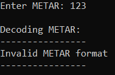

 
<h1 align="left">METAR_Decoder</h3>
The C++ program is designed to decipher METAR codes — meteorological reports for airfields. It accepts a METAR code from the user, parses it into components (airfield, time, wind, visibility, cloudiness, temperature, pressure, comments) and outputs them in a readable form.
The program works in a loop, allowing new codes to be entered before entering "exit". Supports basic METAR elements and correctly handles incorrect input.

To exit the program, type the command "exit"
 

If you enter an incorrect METAR you will receive the following:
 
 

METAR decoder usage example:
 
 

